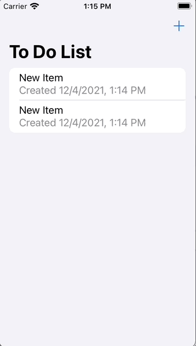

# Todo
## CloudKit - Core Data example

This the demo project for the 4-Dec-2021 meeting for a flock of swifts show casing a number of new language and SDK features:

* CloudKit synching across devices with `NSPersistentCloudKitContainer`
* Use of an `actor` for the service layer behind an `async` protocol
* Dependency injection using the `Environment` for an immuatable object that does not confirm to `ObervableObject`
* MVVM List-Cell viewModels with the cells as simple immuatble structs that delegate their logic back to the parent viewmodel
* Use of the async `task` modifier to scope subscriptions to the lifetime of a view
